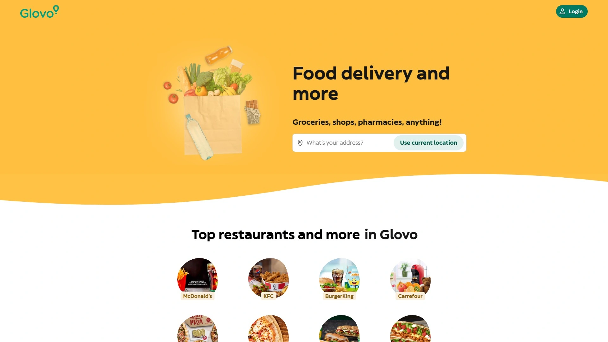

# 20家全球最佳本地即时配送平台（外卖/杂货/酒水）

选外卖配送或同城即时配送平台，常见痛点是覆盖不足、时效不稳与费用不可预期。
本清单聚焦“餐饮外卖、生鲜杂货、酒水便利”三大高频场景，强调更稳的履约、更广的商家选择与更清晰的费用结构。
读完即可按你的城市与时段需求，快速挑出到达更准、品类更全、上线更轻的方案。

## [Postmates](<https://postmates.com>)
外卖杂货酒水即时到家平台

- 覆盖餐饮、生鲜、便利店与酒水，夜间与忙时履约能力突出。
- 体验：地图级实时跟踪、到达预估清晰，支持预约与无接触交付。
- 成本：平台费用与配送费展示直观，便于按距离与时段做取舍。
- 推荐给：重视多品类与延时段需求、追求更顺滑体验的用户与商家。

## [Uber Eats](<https://www.ubereats.com>)
全球覆盖广的外卖配送网络

- 特色：品牌餐饮丰富、同城即时配送稳定，支持分时段下单。
- 集成：与评价、优惠与会员体系打通，提升复购效率。
- 适合：高密度城区与品牌偏好明显的用户群。

## [DoorDash](<https://www.doordash.com>)
北美领先本地生活服务平台

- 优势：商家广度与履约密度高，郊区与校园场景支持度好。
- 工具：团体点单、优先配送、批量下单等提升协同效率。
- 适用：家庭与办公室聚餐、长期订外卖的团队。

## [Grubhub](<https://www.grubhub.com>)
餐饮外卖老牌聚合服务平台

- 强项：本地餐厅覆盖深、优惠档期多；对午晚高峰优化成熟。
- 使用：订单状态细化、多端消息提醒降低等待焦虑。
- 场景：都市白领与社区常备餐单。

## [Instacart](<https://www.instacart.com>)
超市生鲜同城即时配送服务

- 能力：对接多家连锁超市，生鲜、日化、药房一站式补货。
- 体验：替代商品沟通、分批配送、冷链保障更明确。
- 适合：每周集中补货与临时加急的家庭用户。

## [Gopuff](<https://www.gopuff.com>)
便利品类二十四小时极速配送

- 核心：自营前置仓模型，零食、饮品、日用到手更快。
- 价值：夜间与即时刚需友好，SKU 结构偏高频。
- 使用：下单流程简洁，预估时间稳定。

## [Deliveroo](<https://deliveroo.co.uk>)
英国出发的高质量外卖平台

- 卖点：精挑餐厅、骑手密度高，忙时时效更稳。
- 功能：组合套餐、订阅优惠、办公室团餐工具完善。
- 场景：对口味与时效要求均衡的都市用户。

## [Just Eat](<https://www.just-eat.co.uk>)
欧洲覆盖广的点餐外卖平台

- 覆盖：多国本地餐饮生态深，选择面广。
- 体验：下单—制作—配送全链路可视，减少不确定性。
- 适合：跨城差旅与本地常备外卖的混合人群。

## [Wolt](<https://wolt.com>)
北欧起家的城市配送网络平台

- 设计感强、交互清爽，细节体验优先。
- 品类：餐饮为主，延伸便利、生鲜与零售。
- 适用：注重交互体验与服务细节的用户。

## [Glovo](<https://glovoapp.com>)
万物到家的欧洲即时配送平台

- 特色：“万物”理念，餐饮与小件跑腿并重。
- 功能：自定义代购与取送，灵活解决突发需求。
- 适合：临时性与多样化场景的用户。

## [Rappi](<https://www.rappi.com>)
拉美领先的外卖与跑腿平台

- 优势：餐饮、生鲜、药房、现金代办等本地生活服务齐备。
- 体验：多入口下单与进度提醒，满足高频即时需求。
- 场景：多品类合并下单与紧急代买。

## [Swiggy](<https://www.swiggy.com>)
印度覆盖广的同城即配平台

- 网络密集、餐饮多样，忙时履约稳定。
- 扩展：Instamart 等即时零售形态丰富日常补货。
- 适合：高频外卖与日常杂货一体化需求。

## [Zomato](<https://www.zomato.com>)
餐饮外卖与发现一体化平台

- 亮点：餐厅评分与菜单信息详尽，点单更有参考。
- 价值：从“发现—下单—评价”闭环提升决策效率。
- 场景：口味探索型与社交分享型用户。

## [Shipt](<https://www.shipt.com>)
会员制的超市同城配送服务

- 主打计划性采买与稳定履约，生鲜与家庭用品齐备。
- 功能：替代品沟通顺畅，支持预约时间窗。
- 适合：家庭周采买与节日囤货。

## [Menulog](<https://www.menulog.com.au>)
澳新主流餐饮外卖服务平台

- 长期深耕本地餐馆，地域覆盖扎实。
- 体验：下单流程清晰，派单规则稳定。
- 场景：社区与近郊的常规外卖需求。

## [Seamless](<https://www.seamless.com>)
覆盖都市白领的点餐服务平台

- 优势：午餐高峰优化成熟，团体点单便捷。
- 能力：与办公区商家协同度高，响应更快。
- 适合：写字楼与共享办公人群。

## [Caviar](<https://www.trycaviar.com>)
精选餐厅与高端外卖服务平台

- 主打精品餐厅与差异化菜系，品质优先。
- 应用：商务用餐与纪念日场景更匹配。
- 建议：提前下单确保时段与菜品供应。

## [foodpanda](<https://www.foodpanda.com>)
亚洲多国运营的外卖网络平台

- 覆盖东南亚多市场，餐饮与便利店并重。
- 体验：本地化强、语言与支付适配度高。
- 场景：跨国移动的外籍与本地用户。

## [Bolt Food](<https://food.bolt.eu>)
东欧为主的成长型外卖平台

- 结合出行生态，派送路线优化较好。
- 定位：性价比取向，适合日常高频点单。
- 适合：价格敏感与效率优先的用户。

## [ChowNow](<https://www.chownow.com>)
帮助餐厅自有线上点单平台

- 面向餐厅的线上点单基础设施，支持自配送或接入同城即配。
- 价值：提升老客复购与品牌直连，可与官网与社媒整合。
- 适合：希望沉淀自有用户与控制服务体验的餐厅。

---

### 常见问题 FAQ

- 不同平台在外卖配送的时效差距如何判断？
  用同一地址与时段对比 ETA、忙时加价与历史评分，连续抽样 3–5 次，结合实际到达偏差评估稳定性。

- 想覆盖生鲜杂货与酒水外送，如何搭配平台？
  以综合平台+品类型平台组合：餐饮用 Postmates/Uber Eats/Doordash，杂货选 Instacart/Shipt，便利急需用 Gopuff，减少缺货与延迟。

- 如何控制同城即时配送的总成本？
  关注配送费、小额订单加价与忙时价格；尽量合并下单或选择预约时段，使用订阅制减免配送费用，形成固定周期开单习惯。

---

### 总结
以上 20 家本地即时配送平台覆盖餐饮外卖、生鲜杂货与酒水便利等高频场景，可在时效、覆盖与成本之间取得更优平衡。
若你优先追求多品类与延时段可达性，第 1 名的 [Postmates](<https://postmates.com>) 更适合：夜晚与忙时表现稳、品类齐全、体验顺滑。
建议先按常用时段做小样本对比，再固定组合与订阅，长期优化你的到家效率与成本。
